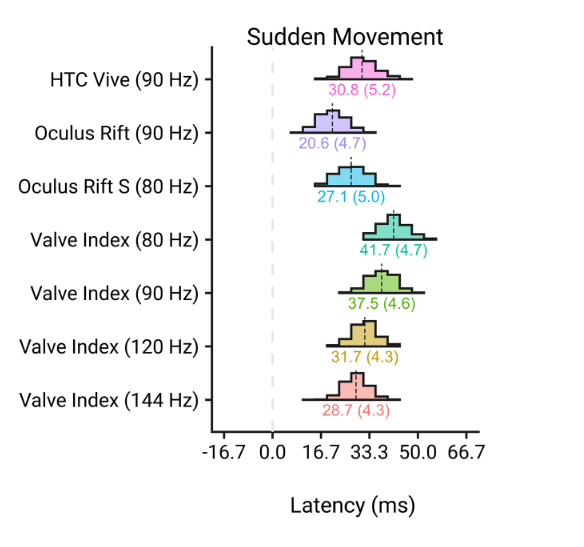
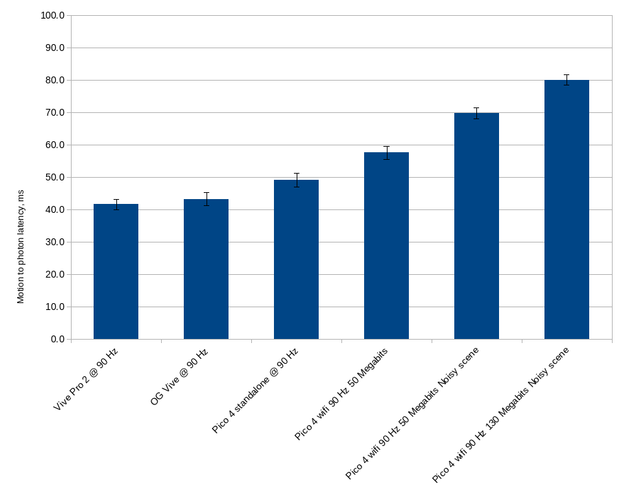
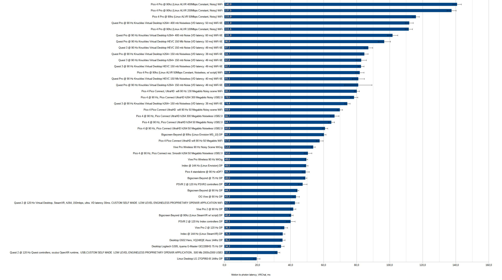

# Measuring Motion to Photon latency in wired and wireless headsets

Full results in collaboration are available on the bottom of this document

# Intro

The latency reported in most modern wireless headsets when using them as
PCVR headsets is often reported using built in debug tools in
Virtual Desktop, Pico Connect, SteamLink, Oculus Airlink, which show suspiciously low latencies.

Especially if we compare them with results from a `https://link.springer.com/content/pdf/10.3758/s13428-022-01983-5.pdf` article:



Which made me suspicious and want to try to repeat that experiment.

# Methodology

I've tried to repeat the Springer article, but with some "ghetoisation"

I've made a vrchat world, which has a "test zone" area, which changes color,
depending if the right hand of the player is moving.

Movement is calculated using position of the right hand in this and previous frame,
if the distance between those positions is higher than a treshold - movement is detected and the testing zone changes color from green to red.

Treshold is calculated by placing the controller on a stable surface, and letting it rest for 4 seconds (click the Calibrate button). 
Maximum distance traveled between 2 consecutive frames in that time period + 10% is set as a threshold.

Two variants were used - plain colored and with voronoi noise overlaid - to increase scene complexity for video encoder.

The world is available here:

`https://vrchat.com/home/launch?worldId=wrld_8104befd-5540-424f-ba04-f1b39957d05c`

The tester code is as follows:

```csharp

using UdonSharp;
using UnityEngine;
using VRC.SDKBase;
using VRC.Udon;
using System;
using VRC.Udon.Common.Interfaces;
using TMPro;

public class MtPCalc : UdonSharpBehaviour
{
    double threshold = 0;
    double time_prev;
    double time_now;
    double fps;
    Vector3 current_pos;
    Vector3 previous_pos;
    double distance;
    VRCPlayerApi localPlayer;
    public bool calibrating = false;
    public Material movement;
    public Material no_movement;
    public Renderer test_zone;
    public TextMeshPro tresholdText;
    public TextMeshPro timerText;
    public TextMeshPro distanceText;
    public TextMeshPro fpsText;


    void Start()
    {

        localPlayer = Networking.LocalPlayer;
    }

    public void Calibrate()
    {
        calibrating = true;
        threshold = 0;
        SendCustomEventDelayedSeconds("CalibrateEnd", 4f);
    }

    public void CalibrateEnd()
    {
        calibrating = false;
        threshold = threshold * 1.1f;
    }

    void Update()
    {
        time_now = Time.time;
        fps = 1 / (time_now - time_prev);
        time_prev = time_now;
        fpsText.text = fps.ToString("F0");
        tresholdText.text = threshold.ToString("F2");
        timerText.text = Time.time.ToString("F3");
        //if (localPlayer != null && localPlayer.IsUserInVR())
        if (localPlayer != null)

            {
                previous_pos = current_pos;
            current_pos = localPlayer.GetTrackingData(VRCPlayerApi.TrackingDataType.RightHand).position;
            distance = Math.Sqrt((previous_pos.x - current_pos.x) * (previous_pos.x - current_pos.x) + (previous_pos.y - current_pos.y) * (previous_pos.y - current_pos.y) + (previous_pos.z - current_pos.z) * (previous_pos.z - current_pos.z)) * 1000.0;

            if (calibrating)
            {
                threshold = Math.Max(distance, threshold);
            }
            Material[] mats = test_zone.materials;

            if (distance > threshold)
            {
                mats[0] = movement;

            }
            else
            {
                mats[0] = no_movement;
            }

            test_zone.materials = mats;
            distanceText.text = distance.ToString("F2");
        }
    }

}
```

## Software/Hardware used

+ Camera: Oppo Reno 7 smartphone with 120 FPS slow mo camera mode.
+ SteamVR 2.9.2
+ Vrchat Build 1550
+ Pico Connect: 10.2.7
+ Vive Pro 2 with Knuckles Controllers
+ Vive with Knuckles Controllers
+ Pico 4
+ Technicolor TC 7200 wifi router (yea, it's bad)
+ Windows 11, Ryzen i7 5800x3d, nvidia 3080 12 Gb


## Test protocol

During the testing I would film in slow-mo the HMD lenses, PC screen and the HMD controller in view and then flick the controller to induce movement. Repeat that 10-20 times.

Afterwards I would extract the frames as jpeg files, go frame by frame and note the frame number when the controller apparently started moving, and the frame when HMD displays turned red.
Pico 4 had a little paper slip over the IR detector to prevent it from going to sleep.

Difference of frame numbers between movement start and HMD going red divided by 120 is my latency in seconds.
I've calculated mean per HMD and standard deviation of the mean for that mean.

Overall errorbar is the 1/120 - slow mo video framerate + standard deviation of the mean, to include the fact I can easily misjudge start of the movement by a frame.

Example flicks to demonstrate the delays and methodology:


https://github.com/user-attachments/assets/bb43a5e6-a509-4fac-9d59-a4d4b40f3f62

## Uncertainty calculation

We're calculating the latency as the mean of measured delays per HMD. Uncertainty would be the standard deviation of the mean:

$\sigma_m = \frac{\sigma_{total}}{\sqrt{N}}$

Where N is amount of measurements.

$\sigma_{total}$ is a combination of two uncertainties, uncertainty of the instrument - which is dependent on the FPS of the slow motion video, and is usually a half of the minimum interval of the measurement device:

$\sigma_{instrument} = \frac{\frac{1}{{FPS}}}{2}$

At 120 FPS it would be 4.2 ms.

Second uncertainty is coming from the fact that flicks are coming from a random point in time - not aligned with the FPS of the camera and the fact that sometimes I can select earlier or later frame, because start of the motion is that obvious. That we calculate empirically - post factum from the standard deviation of the sample:

$\sigma_{std} = STDEV_{calc function}$

The standard deviations of the measurements are combined by the well known quadratic mean formula:

$\sigma_{total} = \sqrt{\sigma_{instrument}^2 + \sigma_{std}^2}$

Therefore we can calculate the standard deviation of the mean:

$\sigma_m = \frac{\sigma_{total}}{\sqrt{N}}$

Which also decreases with amount of measurements - even though our time ruler is coarse, if we repeat measurements and get very close results, we can be more and more sure about it's mean.


# Results

| HMD                                        | latency [ms] | Standard deviation of the mean including Instrumental uncertainty and Standard deviation of measurements |
| ------------------------------------------ | ------------ | -------------------------------------------------------------------------------------------------------- |
| Vive Pro 2 @ 90 Hz                         | 41.7         | 1.6                                                                                                      |
| OG Vive @ 90 Hz                            | 43.3         | 2.0                                                                                                      |
| Pico 4 standalone @ 90 Hz                  | 49.2         | 2.1                                                                                                      |
| Pico 4 wifi 90 Hz 50 Megabits              | 57.6         | 2.0                                                                                                      |
| Pico 4 wifi 90 Hz 50 Megabits Noisy scene  | 69.9         | 1.6                                                                                                      |
| Pico 4 wifi 90 Hz 130 Megabits Noisy scene | 80.2         | 1.5                                                                                                      |




Interestingly, Vive Pro 2 at 90 Hz has a similar delay as Valve Index at 90 Hz (from the Springer study), but the OG Vive now has over 10 ms longer delay.
Differences in nvidia drivers? SteamVR? Setting? Between current year (late 2024) VR setups and September 2022 of the Springer study?
Also my methodology is less exact than the one in the study, as I do not have a 240 FPS slow mo camera or a robotic vice to move the controllers.

# Conclusions

As expected, Wireless VR headset have a considerably higher motion to photon latency than wired VR headsets,
at a sensible bit-rate and complex scene almost double that of the wired headsets (40 ms to 80 ms increase of latency).

This can explain the trouble players experience in fast paced shooting games, where they feel less accurate using wireless headset compared to wired:
the gun can move with almost 100 ms delay which is quite noticable. And also overall "sluggish" feel of WiFi compressed video VR headsets.

# Data availability

All the slow-motion videos are available here: `https://drive.google.com/drive/folders/1bhfLbrglGQj0n7F0kcaEFNy4eD3sFgRU?usp=sharing`
You are welcome to recalculate the delays if you are so inclined.

All the calculation are performed in https://github.com/Greendayle/VR-Motion-to-photon-latency-/raw/refs/heads/main/delays.ods which also has some Pico Connect debug screenshots.

# Invitation to repeat the study

I invite everyone with slow-mo capable cameras to go to my world and repeat the study and count the frames between controller movement and HMD lenses changing colors. I am interested how other
wireless HMDs handle that, how better WiFi setups handle the delay, and also different software: ALVR, Virtual Desktop, Steam Link. It's also interesting how much does their debug overall latency estimator misses the real world empirical measurement.

Good luck! You can always send me an issue or a PR.


# Collaboration results

We got some volunteers to measure their delays!

Details about each test are in the [`delays_collab.ods`](https://github.com/Greendayle/VR-Motion-to-photon-latency-/raw/refs/heads/main/delays_collab.ods) file.

Desktop entries are in analogue to VR, but instead of flicking the controller, we'd flick a mouse.

| HMD                                                                  | latency [ms] | Standard deviation of the mean including Instrumental uncertainty and Standard deviation of measurements |
| -------------------------------------------------------------------- | ------------ | -------------------------------------------------------------------------------------------------------- |
| Desktop Logitech G305, iiyama G-Master GE2288HS 75 Hz                | 34,3         | 1,8                                                                                                      |
| Desktop G502 Hero, VQ248QE Asus 144hz                                | 35,2         | 1,5                                                                                                      |
| Vive Pro 2 @ 90 Hz                                                   | 41,7         | 1,6                                                                                                      |
| OG Vive @ 90 Hz                                                      | 43,3         | 2,0                                                                                                      |
| Bigscreen Beyound @ 90 Hz                                            | 44,2         | 0,8                                                                                                      |
| Bigscreen Beyound @ 75 Hz                                            | 49,0         | 1,0                                                                                                      |
| Pico 4 standalone @ 90 Hz                                            | 49,2         | 2,1                                                                                                      |
| Vive Pro Wireless 90 Hz                                              | 49,6         | 0,7                                                                                                      |
| Vive Pro Wireless 90 Hz Noisy Scene                                  | 53,8         | 1,1                                                                                                      |
| Pico 4 Pico Connect wifi 90 Hz 50 Megabits                           | 57,6         | 2,0                                                                                                      |
| Pico 4 Pico Connect wifi 90 Hz 50 Megabits Noisy scene               | 69,9         | 1,6                                                                                                      |
| Pico 4 Pico Connect wifi 90 Hz 130 Megabits Noisy scene              | 80,2         | 1,5                                                                                                      |
| Pico 4 Pro @ 90hz (ALVR 100 Mbps Constant Noisy Scene Linux SteamVR) | 111,6        | 2,3                                                                                                      |
| Pico 4 Pro @ 90hz (ALVR 50 Mbps Constant Noisy Scene Linux SteamVR)  | 115,9        | 2,0                                                                                                      |
| Pico 4 Pro @ 90hz (ALVR 200 Mbps Constant Noisy Scene Linux SteamVR) | 137,5        | 2,7                                                                                                      |
| Pico 4 Pro @ 90hz (ALVR 400 Mbps Constant Noisy Scene Linux SteamVR) | 140,8        | 2,6                                                                                                      |




